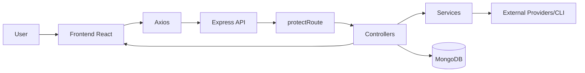
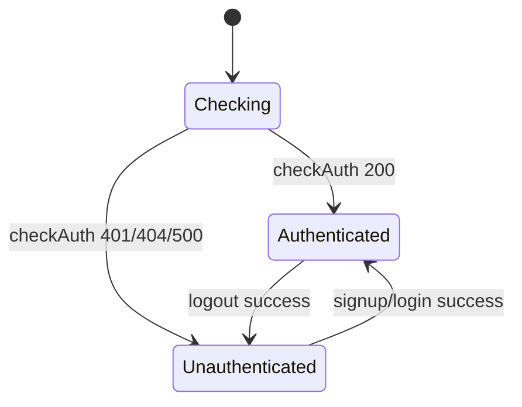
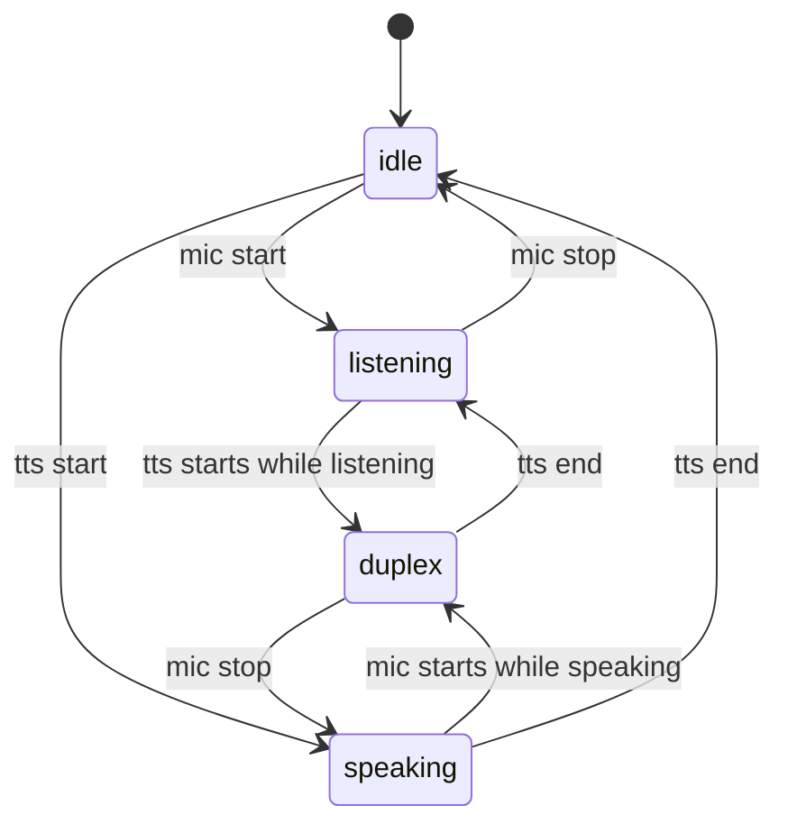
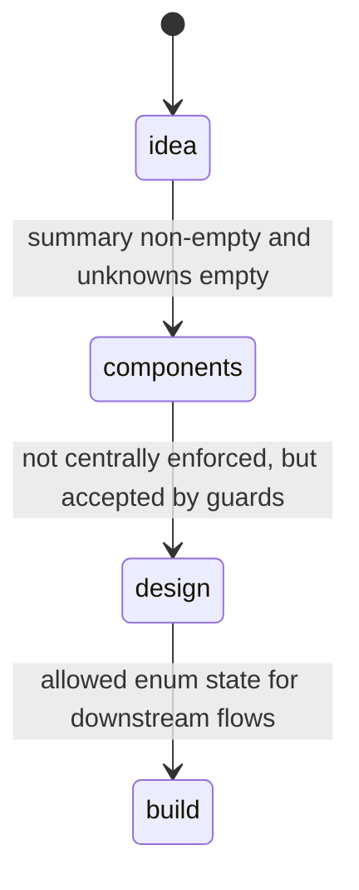

# NovaAI Feature Dossier

This document is the deep technical flow map for the entire codebase.

- Order: Webapp first (frontend + backend), then VS Code extension.
- Scope: Runtime flow, endpoint contracts, function-level ownership, failure paths, and state transitions.
- Source of truth: Implemented behavior in controllers/routes/components/stores/hooks.

---

## 1) System Topography

## 1.1 Runtime Layers

1. Browser UI layer (React pages/components/hooks/stores).
2. API layer (Express routes/controllers + auth middleware).
3. Service layer (LLM orchestration, Wokwi runner, MCP bridge, voice providers).
4. Persistence layer (MongoDB via Mongoose models).
5. External providers (Groq, Deepgram, ElevenLabs, Wokwi CLI, Arduino CLI, Wokwi MCP transport).

## 1.2 Canonical Runtime Graph



## 1.3 Server Boot Sequence

1. Root dev script spawns backend + frontend.
2. Backend server builds middleware chain (CORS, cookies, JSON parser).
3. `/api/*` routes mount.
4. On listen callback:
5. Wokwi CLI readiness check runs.
6. MongoDB connection is established.

Primary files:

- `scripts/dev.mjs`: `startProcess`, `shutdown`.
- `backend/src/index.js`: app bootstrap + route mounting.
- `backend/src/lib/db.js`: `connectDB`.
- `backend/src/lib/wokwi.js`: `checkWokwiCliReady`.

---

## 2) Webapp Feature Dossiers

## 2.1 Auth + Session Guard

### 2.1.1 User flow

1. App mounts.
2. `checkAuth()` runs and calls `GET /api/auth/check`.
3. If JWT cookie/header valid, app gets `authUser` and protected routes unlock.
4. Login/signup set JWT cookie and return user payload.
5. Logout clears cookie and resets auth state.

### 2.1.2 Frontend ownership

- `frontend/src/App.jsx`: route protection and auth bootstrap.
- `frontend/src/store/useAuthStore.js`: `checkAuth`, `signup`, `login`, `logout`.
- `frontend/src/pages/AuthPage.jsx`: submit path for auth.
- `frontend/src/lib/axios.js`: baseURL + `withCredentials: true`.

### 2.1.3 Backend ownership

- `backend/src/routes/auth.route.js`.
- `backend/src/controllers/auth.controller.js`: `signup`, `login`, `logout`, `checkAuth`.
- `backend/src/middleware/auth.middleware.js`: `protectRoute`.
- `backend/src/lib/utils.js`: `generateToken`.
- `backend/src/models/user.model.js`.

### 2.1.4 Contracts

#### `POST /api/auth/signup`

Request body:

```json
{
	"fullName": "string",
	"email": "string",
	"password": "string>=6"
}
```

Success `201`:

```json
{
	"_id": "ObjectId",
	"fullName": "string",
	"email": "string",
	"profilePic": "string",
	"token": "jwt"
}
```

Known failures:

- `400`: missing fields, password too short, duplicate email, invalid user data.
- `500`: internal error.

#### `POST /api/auth/login`

Request body:

```json
{ "email": "string", "password": "string" }
```

Success `200`: same user payload as signup.

Known failures:

- `400`: invalid credentials.
- `500`: internal error.

#### `POST /api/auth/logout`

Success `200`:

```json
{ "message": "Logged out successfully" }
```

#### `GET /api/auth/check`

Requires `protectRoute`.

Success `200`: user object (`req.user`).

Known failures from middleware:

- `401`: no token or invalid/expired token.
- `404`: user not found for decoded token.
- `500`: middleware error.

### 2.1.5 Auth state transition



---

## 2.2 Project Lifecycle (Create/List/Open/Update/Delete)

### 2.2.1 User flow

1. Home loads projects (`GET /api/projects`).
2. Create project (`POST /api/project`) seeds ideation context.
3. Open workspace (`/project/:id`) and fetch full snapshot.
4. Update description/Wokwi URL/local path (`PUT /api/project/:id`).
5. Delete project (`DELETE /api/project/:id`).

### 2.2.2 Frontend ownership

- `frontend/src/pages/HomePage.jsx`: `handleCreateProject`, `handleEditProject`, `handleDeleteProject`.
- `frontend/src/components/ProjectMainPage.jsx`: initial project fetch + Wokwi URL save.

### 2.2.3 Backend ownership

- `backend/src/routes/project.route.js`.
- `backend/src/controllers/project.controller.js`: `createProject`, `getUserProjects`, `getProjectById`, `getIdeationHistory`, `getComponentsHistory`, `updateProject`, `deleteProject`.
- `backend/src/models/project.model.js`.
- `backend/src/services/ai.services.js`: `processInput` (used at create).

### 2.2.4 Contracts

#### `POST /api/project`

Request body:

```json
{ "description": "string" }
```

Success `200`:

```json
{
	"projectId": "ObjectId",
	"reply": "string",
	"ideaState": {
		"summary": "string",
		"requirements": ["string"],
		"unknowns": ["string"]
	}
}
```

Failures:

- `401`: no `req.user`.
- `500`: controller/service errors.

#### `GET /api/projects`

Success `200`: `[Project]` sorted by `createdAt desc`.

#### `GET /api/project/:id`

Success `200`: full `Project` document.

Failures:

- `400`: invalid ObjectId.
- `404`: project not found.
- `403`: owner mismatch.

#### `PUT /api/project/:id`

Accepted fields:

```json
{
	"description": "optional string",
	"wokwiUrl": "optional string",
	"wokwiProjectPath": "optional string"
}
```

Notable validations:

- Empty update set -> `400 Nothing to update`.
- Empty description -> `400 Description cannot be empty`.
- Non-empty invalid Wokwi URL (must match `https://wokwi.com/projects/<digits>`) -> `400`.

Success `200`: updated full project doc.

#### `DELETE /api/project/:id`

Success `200`:

```json
{ "message": "Project deleted" }
```

### 2.2.5 Stage semantics

`meta.stage` enum lives in project model:

- `idea`
- `components`
- `design`
- `build`

Current implemented stage mutation:

- `idea -> components` occurs when ideation finalizes (`summary` non-empty and `unknowns` empty).
- Remaining stage values are currently allowed and consumed as guards, but explicit transitions to `design`/`build` are not centralized in one controller path.

---

## 2.3 Ideation AI (Discovery + Clarification)

### 2.3.1 User flow

1. User starts ideation project by description.
2. AI extracts structured idea state and assistant guidance.
3. User chats iteratively to reduce unknowns.
4. Once unknowns are zero with non-empty summary, ideation is finalized.

### 2.3.2 Frontend ownership

- `frontend/src/components/ProjectChat.jsx`: `sendMessage`, history load, callback `onIdeationStateChange`.

### 2.3.3 Backend ownership

- `backend/src/routes/ideation.route.js`.
- `backend/src/controllers/ideation.controller.js`: `createIdeationProject`, `chatIdeationProject`.
- `backend/src/services/ai.services.js`:
	- `processInput`
	- `normalizeIdeationOutput`
	- `applyIdeationGuards`
	- `buildFallbackIdeationReply`
	- catalog-enforcement helper paths.

### 2.3.4 Contracts

#### `POST /api/project`

Frontend currently uses this for initial create from Home. This route belongs to `project.controller.createProject`.

#### `POST /api/project/chat`

Route target: `ideation.controller.chatIdeationProject`.

Request body:

```json
{
	"projectId": "ObjectId",
	"message": "string"
}
```

Success `200`:

```json
{
	"reply": "string",
	"question": "string",
	"ideaState": {
		"summary": "string",
		"requirements": ["string"],
		"unknowns": ["string"]
	},
	"ideationFinalized": true
}
```

Failures:

- `400`: empty message or invalid projectId.
- `403`: forbidden owner mismatch.
- `404`: project missing.
- `500`: LLM/service/DB errors.

### 2.3.5 Dedup path

`createIdeationProject` has a 60-second dedupe window by same owner + same normalized description.

When deduped, returns existing project with:

- `deduped: true`
- latest AI reply from history
- existing `ideaState` and `ideationFinalized`.

---

## 2.4 Components AI (Architecture + Endpoint Planning + File Generation)

### 2.4.1 User flow

1. Components tab opens.
2. If components history exists, hydrate it.
3. Else call init route to seed first components AI reply.
4. User chats for architecture/components/api endpoints.
5. Optional generate route creates Wokwi assets (`sketchIno`, `diagramJson`, `notes`).

### 2.4.2 Frontend ownership

- `frontend/src/components/ComponentsChat.jsx`: `loadHistoryOrInit`, `sendMessage`, `generateFiles`.

### 2.4.3 Backend ownership

- `backend/src/routes/components.route.js`.
- `backend/src/controllers/components.controller.js`: `initComponents`, `chatComponents`, `generateWokwiFilesFromAI`.
- `backend/src/services/ai.services.js`: `processComponents`, `generateWokwiAssetsFromState`.

### 2.4.4 Guard logic

`canStartComponents(project)` passes when:

- ideation finalized, or
- stage already one of `components/design/build`.

Otherwise responses are `400 Finalize Ideation AI before ...`.

### 2.4.5 Contracts

#### `POST /api/components/init`

Request body:

```json
{ "projectId": "ObjectId" }
```

Success `200`:

```json
{
	"reply": "string",
	"componentsState": {
		"architecture": "string",
		"components": ["string"],
		"apiEndpoints": ["string"]
	}
}
```

#### `POST /api/components/chat`

Request body:

```json
{ "projectId": "ObjectId", "message": "string" }
```

Success `200`: same response shape as init.

#### `POST /api/components/generate-files`

Request body:

```json
{
	"projectId": "ObjectId",
	"userPrompt": "optional string"
}
```

Success `200`:

```json
{
	"projectId": "ObjectId",
	"generated": {
		"sketchIno": "string",
		"diagramJson": {},
		"notes": ["string"]
	}
}
```

---

## 2.5 Design AI (Live Circuit Grounded Guidance)

### 2.5.1 User flow

1. Design page loads project snapshot from route state, then hard-refreshes from backend.
2. If no design messages, init route seeds first design reply.
3. Design chat sends user prompts; backend resolves latest Wokwi context first, then runs AI.
4. Left panel shows Wokwi/local preview; right panel is design dialogue.
5. Local run option performs local file read + sync compile/run + context refresh.

### 2.5.2 Frontend ownership

- `frontend/src/pages/DesignPage.jsx`: orchestration (`pushAssistantMessage`, `handleLocalCompileRun`, URL save, panel split state).
- `frontend/src/components/DesignChat.jsx`: interactive design chat and voice control bar.

### 2.5.3 Backend ownership

- `backend/src/routes/design.route.js`.
- `backend/src/controllers/design.controller.js`: `initDesign`, `chatDesign`, `getDesignContext`.
- `backend/src/services/ai.services.js`: `processDesign`.
- `backend/src/lib/wokwi-context.js`: remote Wokwi URL context extraction.
- `backend/src/services/wokwi-local.service.js`: local file context extraction.

### 2.5.4 Context resolution precedence

1. Try local project path + `diagram.json`.
2. If unavailable/unreadable, try remote `wokwiUrl` parse.
3. If both fail: `connected=false` with combined reason text.

### 2.5.5 Contracts

#### `POST /api/design/init`

Request:

```json
{ "projectId": "ObjectId" }
```

Success `200`:

```json
{
	"reply": "string",
	"designState": {
		"screens": [{ "name": "string", "elements": ["string"], "actions": ["string"] }],
		"theme": "string",
		"uxFlow": ["string"]
	},
	"wokwiContext": {
		"connected": true,
		"source": "local-project-files"
	}
}
```

#### `POST /api/design/chat`

Request:

```json
{ "projectId": "ObjectId", "message": "string" }
```

Success `200`: same shape as init.

#### `GET /api/design/context/:projectId`

Success `200`:

```json
{ "wokwiContext": { "connected": true } }
```

---

## 2.6 Voice Guidance (STT/TTS Duplex)

### 2.6.1 User flow

1. User enables voice in design chat.
2. Hook captures audio chunks from MediaRecorder.
3. Chunk window is transcribed using STT endpoint.
4. Interim transcript updates input.
5. Auto-send timer fires on silence (or delayed by "hold one").
6. Assistant reply triggers TTS playback.

### 2.6.2 Frontend ownership

- `frontend/src/hooks/useVoiceGuidance.js`: 
	- `startListening`
	- `transcribeChunkForCaption`
	- `finalizeBufferedTranscript`
	- `speakText`
	- status computation (`idle/listening/speaking/duplex/unavailable`).
- `frontend/src/components/DesignChat.jsx`: voice controls and diagnostics.

### 2.6.3 Backend ownership

- `backend/src/routes/voice.route.js`.
- `backend/src/controllers/voice.controller.js`: `transcribeAudio`, `synthesizeAudio`, `getVoiceHealth`.
- `backend/src/services/voice.service.js`:
	- `transcribeWithDeepgram`
	- `synthesizeWithElevenLabs`
	- `getVoiceRuntimeHealth`.

### 2.6.4 Contracts

#### `GET /api/voice/health`

Success:

```json
{
	"ok": true,
	"deepgramReady": true,
	"elevenLabsReady": true
}
```

#### `POST /api/voice/stt`

Request:

```json
{
	"audioBase64": "string",
	"mimeType": "audio/webm",
	"language": "en",
	"model": "nova-2",
	"smartFormat": true
}
```

Success:

```json
{
	"provider": "deepgram",
	"transcript": "string",
	"confidence": 0.93,
	"words": []
}
```

Failures:

- `400`: missing audioBase64.
- `413`: payload too large (> 10MB base64 string length guard).
- provider-specific mapped errors with `requestId` + `code` + `details`.

#### `POST /api/voice/tts`

Request:

```json
{
	"text": "string",
	"voiceId": "optional string",
	"modelId": "eleven_multilingual_v2",
	"outputFormat": "mp3_44100_128"
}
```

Success:

```json
{
	"provider": "elevenlabs",
	"contentType": "audio/mpeg",
	"audioBase64": "string"
}
```

### 2.6.5 Voice status state machine



---

## 2.7 Wokwi Proof Lab (Judge-Facing Evidence Plane)

### 2.7.1 User flow

1. User configures local project path + files.
2. Runs one-shot actions (lint/run/scenario/serial).
3. Or runs sync pipeline (write local files -> compile -> run).
4. Views persisted evidence cards.
5. Manages MCP interactive sessions and tool calls.
6. Generates custom chip blueprints via AI.

### 2.7.2 Frontend ownership

- `frontend/src/components/WokwiProofLab.jsx`:
	- `runLint`
	- `runProject`
	- `runScenario`
	- `captureSerial`
	- `syncCompileRun`
	- `startMcpSession`
	- `callMcpTool`
	- `stopMcpSession`
	- `generateCustomChip`.

### 2.7.3 Backend ownership

- `backend/src/routes/wokwi.route.js`.
- `backend/src/controllers/wokwi.controller.js`:
	- `lintProjectWokwi`
	- `runProjectWokwi`
	- `runScenarioWokwi`
	- `captureSerialWokwi`
	- `getWokwiEvidence`
	- `getLocalWokwiFiles`
	- `syncCompileRunWokwi`
	- `getLocalWokwiScreenshot`
	- `generateCustomChipBlueprint`
	- `startInteractiveMcpSession`
	- `callInteractiveMcpTool`
	- `stopInteractiveMcpSession`
	- `listInteractiveMcpSessions`.
- `backend/src/services/wokwi-runner.service.js`.
- `backend/src/services/wokwi-local.service.js`.
- `backend/src/services/wokwi-mcp-client.service.js`.
- `backend/src/services/ai.services.js`: `generateCustomChipTemplate`.

### 2.7.4 Contracts (selected)

#### `POST /api/wokwi/lint`

Request:

```json
{
	"projectId": "ObjectId",
	"projectPath": "optional string",
	"diagramFile": "diagram.json",
	"wokwiUrl": "optional string",
	"timeoutMs": 20000
}
```

Success:

```json
{
	"projectId": "ObjectId",
	"evidenceType": "lint",
	"result": { "ok": true, "summary": "string" }
}
```

#### `POST /api/wokwi/run`

Request includes timeout/expect/fail/screenshot/vcd knobs.

Success:

```json
{
	"projectId": "ObjectId",
	"evidenceType": "run",
	"result": { "ok": true, "serialTail": "string" }
}
```

#### `POST /api/wokwi/scenario`

Requires `scenarioPath` else `400`.

#### `POST /api/wokwi/local/files`

Returns `diagramJson` and `sketchCode` from local disk.

#### `POST /api/wokwi/local/sync-run`

Hard requirements:

- `sketchCode` must be string.
- `diagramJson` required.
- resolved `projectPath` required.

Pipeline stages:

1. write files.
2. compile sketch.
3. if compile fail -> returns `400` with `stage: "compile"` and compile payload.
4. validation of `expectText` in sketch source.
5. run simulation.
6. persist `lastRun` evidence.

Success includes `writeResult`, `compileResult`, `runResult`, screenshot metadata.

#### MCP interactive routes

- `POST /api/wokwi/mcp/session/start`
- `GET /api/wokwi/mcp/sessions`
- `POST /api/wokwi/mcp/session/:sessionId/tool`
- `POST /api/wokwi/mcp/session/:sessionId/stop`

#### Custom chip generation

`POST /api/wokwi/custom-chip/generate` -> returns generated `template` object from AI service.

### 2.7.5 Evidence persistence model

`project.wokwiEvidence` stores:

- `lastLint`
- `lastRun`
- `lastScenario`
- `lastSerialCapture`
- `updatedAt`

---

## 3) Cross-Cutting Runtime Contracts

## 3.1 Auth propagation

- Cookie name: `jwt`.
- Also supports `Authorization: Bearer <token>`.
- Protected routes require valid token + existing user.

## 3.2 CORS and local-dev origins

Allowed:

- `http://localhost:5173`
- `http://localhost:5174`
- `http://127.0.0.1:5173`
- `http://127.0.0.1:5174`

All with credentials enabled.

## 3.3 Error envelope patterns

Patterns are not fully uniform:

- Most controllers use `{ error: "..." }`.
- Auth uses `{ message: "..." }` for several paths.
- Voice returns richer shape: `{ error, code, provider, details, requestId }`.

Frontend compensates with mixed error readers (`error` vs `message`).

---

## 4) State Transition Maps

## 4.1 Project stage



## 4.2 Ideation finalization predicate

Finalized iff:

- `Boolean(project.ideaState.summary.trim())` is true, and
- `project.ideaState.unknowns.length === 0`.

This predicate gates components/design entry.

---

## 5) VS Code Extension Dossier (After Webapp)

## 5.1 Activation and command surface

Entry file: `vscode-extension/src/extension.ts`.

Registered command clusters:

1. Sidebar chat view focus commands.
2. Create local Wokwi project commands.
3. Simulator workbench open/select-path commands.

Activation metadata lives in `vscode-extension/package.json` (`activationEvents`, `contributes.commands`, `contributes.views`, configuration keys).

## 5.2 Simulator Workbench flow

Core class: `NovaAISimulatorPanel`.

Primary methods:

- `ensureInitialPathPrompt`
- `selectPath`
- `open`
- `postScanResult`
- `scanSimulationFolder`
- `collectFiles`
- `openFile`
- `loadProjectData`
- `playSimulation`

Behavior:

1. Prompts for simulation folder if none is saved.
2. Scans recursively for `diagram.json`, `wokwi.toml`/`wokwi.ini`/`diagram.ini`, and sketch sources.
3. Loads/parses project artifacts.
4. Optionally selects Wokwi config file via `wokwi-vscode.selectConfigFile`.
5. Starts simulator with `wokwi-vscode.start`.

## 5.3 Sidebar projects view flow

Core class: `WokwiProjectsViewProvider`.

Primary methods:

- `promptAndCreateProject`
- `resolveWebviewView`
- `toTemplate`
- `getWebAppUrl`
- `getBackendUrl`
- `postProjectsList`
- `getProjectsRoot`
- `slugify`
- `createProject`
- `getTemplateFiles`
- `listProjects`
- `openProject`

Project templates supported:

- `arduino-uno`
- `esp32-devkit-v1`
- `raspberry-pi-pico`

Each generated project writes:

- `sketch.ino`
- `diagram.json`
- `libraries.txt`
- `.NovaAI-wokwi.json`

## 5.4 Extension tests

`vscode-extension/src/test/extension.test.ts` currently contains only sample assertions scaffold.

---

## 6) Complete File Coverage Matrix

This section explicitly covers all major files by functional bucket.

## 6.1 Root/workspace

- `package.json`
- `scripts/dev.mjs`
- `describe.md`
- `docs.md`
- `ins.md`
- `newly_done.md`
- `do.md`
- `tasks.md`

## 6.2 Backend app

- `backend/package.json`
- `backend/src/index.js`
- `backend/src/lib/db.js`
- `backend/src/lib/utils.js`
- `backend/src/lib/wokwi.js`
- `backend/src/lib/wokwi-context.js`
- `backend/src/lib/wokwi-components.js`
- `backend/src/middleware/auth.middleware.js`
- `backend/src/models/user.model.js`
- `backend/src/models/project.model.js`
- `backend/src/routes/auth.route.js`
- `backend/src/routes/project.route.js`
- `backend/src/routes/ideation.route.js`
- `backend/src/routes/components.route.js`
- `backend/src/routes/design.route.js`
- `backend/src/routes/voice.route.js`
- `backend/src/routes/wokwi.route.js`
- `backend/src/controllers/auth.controller.js`
- `backend/src/controllers/project.controller.js`
- `backend/src/controllers/ideation.controller.js`
- `backend/src/controllers/components.controller.js`
- `backend/src/controllers/design.controller.js`
- `backend/src/controllers/voice.controller.js`
- `backend/src/controllers/wokwi.controller.js`
- `backend/src/services/ai.services.js`
- `backend/src/services/voice.service.js`
- `backend/src/services/wokwi-runner.service.js`
- `backend/src/services/wokwi-local.service.js`
- `backend/src/services/wokwi-mcp-client.service.js`

## 6.3 Backend simulation fixture directories

- `backend/wokwi-smoke/diagram.json`
- `backend/wokwi-smoke/sketch.ino`
- `backend/wokwi-smoke/smoke.test.yaml`
- `backend/wokwi-smoke/wokwi.toml`
- `backend/wokwi-smoke/build/NovaAI_sketch.ino.eep`
- `backend/wokwi-smoke-intense/diagram.json`
- `backend/wokwi-smoke-intense/sketch.ino`
- `backend/wokwi-smoke-intense/wokwi.toml`
- `backend/wokwi-smoke-intense/build/NovaAI_sketch.ino.eep`

## 6.4 Frontend app

- `frontend/package.json`
- `frontend/index.html`
- `frontend/vite.config.js`
- `frontend/eslint.config.js`
- `frontend/README.md`
- `frontend/src/main.jsx`
- `frontend/src/App.jsx`
- `frontend/src/index.css`
- `frontend/src/lib/axios.js`
- `frontend/src/store/useAuthStore.js`
- `frontend/src/store/useThemeStore.js`
- `frontend/src/pages/HeroPage.jsx`
- `frontend/src/pages/AuthPage.jsx`
- `frontend/src/pages/HomePage.jsx`
- `frontend/src/pages/DesignPage.jsx`
- `frontend/src/components/ProjectMainPage.jsx`
- `frontend/src/components/ProjectChat.jsx`
- `frontend/src/components/ComponentsChat.jsx`
- `frontend/src/components/DesignChat.jsx`
- `frontend/src/components/WokwiProofLab.jsx`
- `frontend/src/hooks/useVoiceGuidance.js`
- `frontend/public/*` static assets (non-critical runtime logic).

## 6.5 VS Code extension

- `vscode-extension/package.json`
- `vscode-extension/esbuild.js`
- `vscode-extension/eslint.config.mjs`
- `vscode-extension/tsconfig.json`
- `vscode-extension/README.md`
- `vscode-extension/CHANGELOG.md`
- `vscode-extension/vsc-extension-quickstart.md`
- `vscode-extension/i_did_this.md`
- `vscode-extension/src/extension.ts`
- `vscode-extension/src/test/extension.test.ts`

---

## 7) Notable Implementation Nuances (Important for Contributors)

1. There are two project-creation paths in backend (`project.controller.createProject` and `ideation.controller.createIdeationProject`), but frontend currently creates via `/api/project`.
2. Error payload shape is not globally standardized (`error` vs `message`).
3. Components/design guards are based on ideation finalization predicate and accepted stage enums.
4. Voice hook intentionally rate-limits chunk STT and has payload-size protection to avoid latency/memory spikes.
5. Proof Lab local sync-run includes a compile gate and sketch validation gate (`expectText`).

---

## 8) Fast "User Journey" (Narrative Compression)

1. User authenticates (cookie JWT set).
2. User creates a project from Home.
3. Ideation chat builds summary/requirements and clears unknowns.
4. Components chat defines architecture + implementation surface.
5. Files can be AI-generated (`sketch.ino`, `diagram.json`).
6. Design chat runs with live circuit grounding (local/remote Wokwi context).
7. Voice loop can run duplex for hands-free iteration.
8. Proof Lab executes real compile/simulate/scenario/serial/MCP flows and persists evidence.
9. Optional VS Code extension drives local Wokwi workflow from sidebar + workbench.

